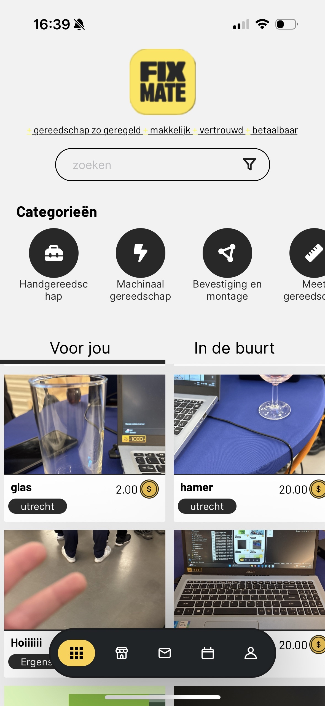

# FixMate
A proof of concept mobile application offering a marketplace for the lending and reservation of products.

Trying to offer a state-of-art solution with reputation for customer protection and that of the lender by utilising fail to care disputal systems.

# Maintainers
#### Project leads
- Niels Janssen
- Hans Bastiaan

#### Frontend/app:
- Efdal Sancak (aka z3ntl3) 
    > Allround developer for frontend and backend with a technical lead: a core contributor.
- Wisdom Moore
    > Junior frontend developer and Business Consultant
- Jaimy van Dijk 
    > Prototyping and design
- Mees Kalkhoven
    > Prototyping, design, Business Consultant and SCRUM master

#### Backend / app
- Efdal Sancak (aka z3ntl3)
    > Allround developer for frontend and backend with a technical lead: a core contributor.
- Hao Xiang Wong
    > Junior backend developer
- Dominique Scoop
    > Junior backend developer

### Tech Stack
- React Native (app)
- Go (backend)

We will archive and publish the backend just like this repo in the near future.